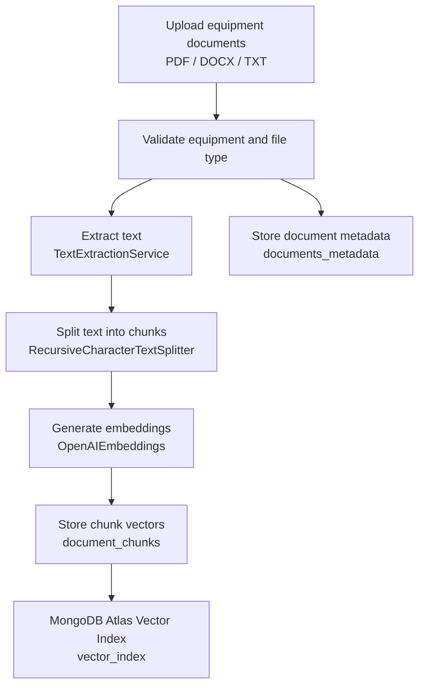
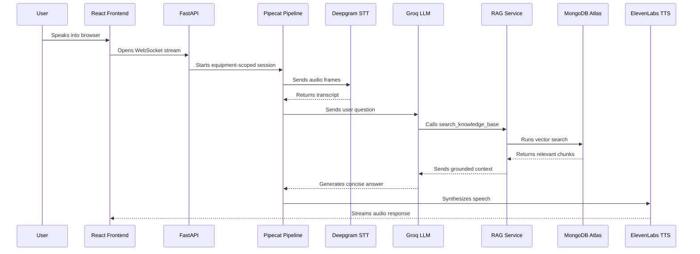

# RAG Voice AI Agent

Real-time voice assistant for industrial equipment support, built with FastAPI, React, Pipecat, MongoDB Atlas Vector Search, and Retrieval-Augmented Generation.

This project helps a support agent or operator ask questions about equipment manuals, SOPs, and troubleshooting documents through a voice-first interface. The backend retrieves relevant document chunks from a vector knowledge base and generates grounded, concise responses for real-time conversations.

## Screenshot Placeholders

Add your final screenshots here before sharing the repository.

### Frontend UI

<!-- Add frontend screenshot here -->
<!-- Example:  -->

### FastAPI Swagger UI

<!-- Add FastAPI docs screenshot here -->
<!-- Example:  -->

### Voice Assistant In Action

<!-- Optional: Add a conversation or live demo screenshot here -->
<!-- Example:  -->

## Recruiter-Friendly Summary

| Area | Details |
| --- | --- |
| Project Type | Full-stack AI application |
| Domain | Industrial support, call-center assistance, equipment knowledge retrieval |
| Core AI Pattern | Retrieval-Augmented Generation (RAG) |
| Voice Stack | Pipecat, Deepgram STT, ElevenLabs TTS, WebSocket audio streaming |
| Backend | FastAPI, Python 3.12, Motor, MongoDB Atlas |
| Frontend | React 18, TypeScript, Vite, Tailwind CSS |
| Vector Search | MongoDB Atlas Vector Search with OpenAI embeddings |
| LLM Provider | Groq-compatible OpenAI API endpoint |
| Deployment Readiness | Dockerized frontend and backend, production Nginx config, AWS deployment guide |

## Project Highlights

- Built a full-stack voice AI assistant with real-time WebSocket audio streaming.
- Implemented an equipment-scoped RAG workflow so answers are grounded in uploaded technical documents.
- Designed async FastAPI services for document upload, embedding generation, vector retrieval, and live voice sessions.
- Integrated multiple AI services into one production-style pipeline: STT, LLM function calling, vector search, and TTS.
- Prepared the application for containerized deployment with Docker, Nginx, and AWS deployment documentation.

## Key Features

- Real-time voice conversation over WebSocket using Pipecat transport.
- Equipment-specific knowledge bases for contextual answers.
- Upload API for technical documents such as PDFs, DOCX files, and text files.
- Automatic text extraction, chunking, embedding generation, and vector storage.
- RAG retrieval with MongoDB Atlas `$vectorSearch`.
- LLM function calling to search the knowledge base during conversation.
- Speech-to-text with Deepgram and text-to-speech with ElevenLabs.
- React dashboard for starting a live assistant session.
- FastAPI Swagger UI for testing REST endpoints.
- Docker-ready frontend and backend services.

## Architecture

```mermaid
flowchart LR
    user["Support Agent / Operator"]
    browser["React + TypeScript Frontend<br/>Pipecat Client"]
    api["FastAPI Backend<br/>REST + WebSocket APIs"]
    voice["Pipecat Voice Pipeline<br/>VAD + STT + LLM + TTS"]
    stt["Deepgram<br/>Speech-to-Text"]
    llm["Groq LLM<br/>Function Calling"]
    tts["ElevenLabs<br/>Text-to-Speech"]
    rag["RAG Service<br/>Semantic Retrieval"]
    embed["OpenAI Embeddings<br/>text-embedding-3-small"]
    mongo["MongoDB Atlas<br/>Documents + Vector Search"]

    user -->|"Voice input / audio output"| browser
    browser -->|"POST /stream/connect"| api
    browser <-->|"WebSocket audio stream"| api
    api --> voice
    voice --> stt
    stt --> llm
    llm -->|"search_knowledge_base(query)"| rag
    rag --> embed
    rag -->|"vectorSearch + metadata filters"| mongo
    mongo -->|"Top relevant chunks"| rag
    rag --> llm
    llm --> tts
    tts --> voice
    voice --> api
    api --> browser
```



## RAG Document Ingestion Flow



## Request Lifecycle



## Tech Stack

### Backend

- FastAPI for REST endpoints, health checks, and WebSocket routes.
- Pipecat for real-time audio pipeline orchestration.
- MongoDB Atlas and Motor for async document storage and vector retrieval.
- OpenAI embeddings via LangChain.
- Groq LLM integration for conversational reasoning and tool calling.
- Deepgram for speech-to-text.
- ElevenLabs for text-to-speech.
- Loguru for structured application logging.

### Frontend

- React 18 with TypeScript.
- Vite for fast local development and production builds.
- Tailwind CSS for styling.
- `@pipecat-ai/client-react` and WebSocket transport for real-time voice sessions.
- Axios-based API utility layer.

### DevOps

- Dockerfile for the FastAPI backend.
- Multi-stage Dockerfile for the React frontend.
- Nginx config for serving the production frontend.
- Deployment notes for AWS ECS Fargate, ECR, ALB, Secrets Manager, and CloudWatch.

## API Surface

| Method | Endpoint | Purpose |
| --- | --- | --- |
| `GET` | `/` | API status message |
| `GET` | `/health` | Health check |
| `POST` | `/api/v1/equipment/` | Create equipment record |
| `GET` | `/api/v1/equipment/` | List equipment |
| `GET` | `/api/v1/equipment/{equipment_id}` | Get one equipment record |
| `POST` | `/api/v1/equipment/{equipment_id}/documents` | Upload and embed equipment documents |
| `GET` | `/api/v1/equipment/{equipment_id}/documents` | List uploaded documents |
| `POST` | `/api/v1/stream/connect` | Generate voice WebSocket URL |
| `WS` | `/api/v1/stream/ws/{equipment_id}` | Real-time voice assistant stream |

## Repository Structure

```text
.
|-- backend/
|   |-- app/
|   |   |-- __init__.py
|   |   |-- bot.py                         # Pipecat voice pipeline: VAD, STT, LLM, TTS
|   |   |-- config.py                      # Pydantic settings loaded from backend/.env
|   |   |-- database.py                    # Async MongoDB connection lifecycle
|   |   |-- models/
|   |   |   |-- __init__.py
|   |   |   |-- document.py                 # Document metadata model
|   |   |   |-- equipment.py                # Equipment model
|   |   |   `-- rag.py                      # Retrieval response models
|   |   |-- routers/
|   |   |   |-- __init__.py
|   |   |   |-- equipment.py                # Equipment CRUD and document upload APIs
|   |   |   `-- stream.py                   # Voice session connect and WebSocket APIs
|   |   `-- services/
|   |       |-- __init__.py
|   |       |-- embeddings.py               # Text splitting and OpenAI embedding calls
|   |       |-- rag.py                      # MongoDB Atlas vector search retrieval
|   |       `-- text_extraction.py          # PDF, DOCX, and text extraction service
|   |-- Dockerfile                         # Backend container image
|   |-- README.md                          # Backend package README placeholder
|   |-- main.py                            # FastAPI application entry point
|   |-- pyproject.toml                     # Python dependencies and project metadata
|   `-- uv.lock                            # Locked Python dependency graph
|-- frontend/
|   |-- src/
|   |   |-- components/
|   |   |   |-- BotJsonCard.tsx             # RAG chunk/result display card
|   |   |   |-- BotMessageBubble.tsx        # Assistant message UI
|   |   |   |-- RealTimeChatPanel.tsx       # Main voice assistant panel
|   |   |   `-- UserMessageBubble.tsx       # User transcript/message UI
|   |   |-- hooks/
|   |   |   `-- pipecat-chat-events.ts      # Pipecat event handling hook
|   |   |-- pages/
|   |   |   `-- Stream.tsx                  # Voice streaming page
|   |   |-- types/
|   |   |   |-- BotJson.ts
|   |   |   |-- ChatMessage.ts
|   |   |   |-- Chunk.ts
|   |   |   `-- ServerMessage.ts
|   |   |-- utils/
|   |   |   |-- api.ts                      # API client helpers
|   |   |   `-- chat.ts                     # Chat formatting helpers
|   |   |-- App.css
|   |   |-- App.tsx                        # React router setup
|   |   |-- index.css
|   |   `-- main.tsx                       # React application bootstrap
|   |-- Dockerfile                         # Multi-stage frontend container image
|   |-- index.html
|   |-- nginx.conf                         # Production static server config
|   |-- package-lock.json
|   |-- package.json                       # Frontend dependencies and scripts
|   |-- postcss.config.js
|   |-- tailwind.config.js
|   |-- tsconfig.json
|   |-- tsconfig.node.json
|   `-- vite.config.ts
|-- infrastructure/                        # Reserved for infrastructure assets/scripts
|-- .gitignore
|-- ArchitectureDiagram.png                # Existing architecture image asset
|-- ASSIGNMENTS_AND_QUIZZES.md             # Supporting academic/project material
|-- DEPLOYMENT.md                          # AWS deployment guide
|-- PROJECT_REPORT.md                      # Detailed project report
|-- README.md                              # Main recruiter-friendly documentation
`-- Useful_links.md                        # Reference links
```

## Core Backend Modules

| Module | Responsibility |
| --- | --- |
| `main.py` | Creates the FastAPI app, configures CORS, registers routers, and manages startup/shutdown lifecycle. |
| `app/routers/equipment.py` | Handles equipment records, document upload, text extraction, embedding generation, and document listing. |
| `app/routers/stream.py` | Creates WebSocket URLs and starts equipment-scoped real-time voice sessions. |
| `app/bot.py` | Orchestrates the Pipecat pipeline with Deepgram STT, Groq LLM, RAG function calling, and ElevenLabs TTS. |
| `app/services/rag.py` | Runs MongoDB Atlas vector search with equipment and tenant filters. |
| `app/services/embeddings.py` | Splits document text and generates embeddings using OpenAI embeddings. |

## Core Frontend Modules

| Module | Responsibility |
| --- | --- |
| `src/pages/Stream.tsx` | Initializes the Pipecat client and renders the real-time chat panel. |
| `src/components/RealTimeChatPanel.tsx` | Main voice assistant interface for selecting equipment and managing a live session. |
| `src/hooks/pipecat-chat-events.ts` | Converts Pipecat server/client events into UI-ready chat state. |
| `src/utils/api.ts` | Central API helper for backend calls. |
| `src/types/` | Shared TypeScript contracts for chat messages, chunks, and server payloads. |

## Local Setup

### Prerequisites

- Python 3.12+
- Node.js 20+
- MongoDB Atlas cluster with Vector Search enabled
- Deepgram API key
- Groq API key
- OpenAI API key
- ElevenLabs API key, optional if voice output is not required in early testing

### Backend Environment

Create `backend/.env`:

```env
MONGO_URL=mongodb+srv://<user>:<password>@<cluster>.mongodb.net
DB_NAME=live_db

DEEPGRAM_API_KEY=your_deepgram_key
GROQ_API_KEY=your_groq_key
GROQ_MODEL=openai/gpt-oss-20b
GROQ_BASE_URL=https://api.groq.com/openai/v1

OPENAI_API_KEY=your_openai_key
EMBEDDING_MODEL=text-embedding-3-small
VECTOR_INDEX_NAME=vector_index
DOCUMENT_CHUNKS_COLLECTION=document_chunks

ELEVENLABS_API_KEY=your_elevenlabs_key
ELEVENLABS_VOICE_ID=pNInz6obpgDQGcFmaJgB

TENANT_ID=mvp_tenant
USER_ID=mvp_user
```

### Run Backend

```bash
cd backend
uv sync
uv run uvicorn main:app --host 0.0.0.0 --port 8000 --reload
```

FastAPI docs:

```text
http://localhost:8000/docs
```

### Run Frontend

```bash
cd frontend
npm install
npm run dev
```

Frontend:

```text
http://localhost:5173
```

## MongoDB Atlas Vector Search

The default backend configuration expects:

- Database: `live_db`
- Chunk collection: `document_chunks`
- Vector field: `embedding`
- Vector index name: `vector_index`
- Default embedding model: `text-embedding-3-small`

For the default OpenAI embedding model, configure the vector index with 1536 dimensions. Also ensure metadata fields such as `equipment_id`, `tenant_id`, and `is_disabled` can be used for filtering during retrieval.

## Deployment Notes

The repository includes Dockerfiles for both services:

- Backend: Python 3.12 slim image with `uv`
- Frontend: Node 20 build stage and Nginx production stage

For cloud deployment details, see [DEPLOYMENT.md](DEPLOYMENT.md). The deployment guide describes an AWS-oriented setup using ECS Fargate, Application Load Balancer routing, ECR, Secrets Manager, and CloudWatch.

## What This Demonstrates

- Full-stack AI product engineering.
- Real-time WebSocket architecture.
- Production-style FastAPI service design.
- RAG with vector search and equipment-level filtering.
- Voice AI pipeline orchestration.
- Async Python and MongoDB integration.
- Type-safe React frontend development.
- Docker-based deployment readiness.

## Future Improvements

- Add authentication and role-based access control.
- Add document deletion and re-indexing workflows.
- Store conversation transcripts and retrieval traces.
- Add automated backend and frontend tests.
- Add observability dashboards for latency, retrieval quality, and usage.
- Add CI/CD workflow files for automated AWS deployment.
